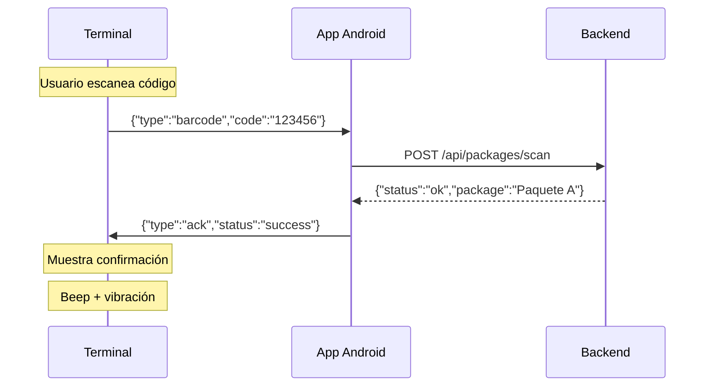
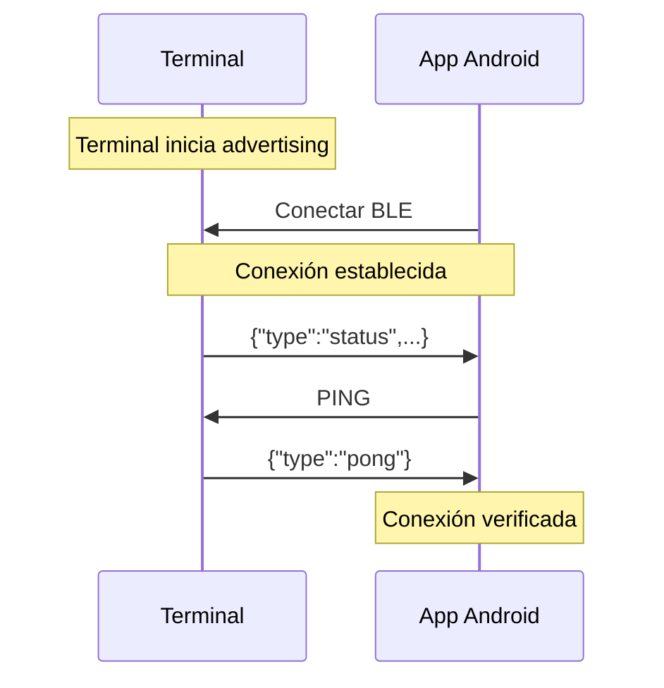

# Protocolo de Comunicación BLE - Terminal de Mensajería

## 1. Visión General

El terminal se comunica con la aplicación Android mediante Bluetooth Low Energy (BLE) usando el perfil Nordic UART Service (NUS), que emula una conexión serial sobre BLE.

### Características
- **Perfil**: Nordic UART Service (NUS)
- **Versión BLE**: 5.0
- **Alcance**: 10+ metros
- **MTU**: 512 bytes (negociable)
- **Seguridad**: Pairing con PIN (opcional)

---

## 2. UUIDs del Servicio

### Servicio Principal
```
Service UUID: 6E400001-B5A3-F393-E0A9-E50E24DCCA9E
```

### Características

#### RX Characteristic (Smartphone → Terminal)
```
UUID: 6E400002-B5A3-F393-E0A9-E50E24DCCA9E
Properties: WRITE
Descripción: Envío de comandos desde la app al terminal
```

#### TX Characteristic (Terminal → Smartphone)
```
UUID: 6E400003-B5A3-F393-E0A9-E50E24DCCA9E
Properties: NOTIFY
Descripción: Envío de datos desde el terminal a la app
Descriptor: Client Characteristic Configuration (0x2902)
```

---

## 3. Formato de Mensajes

Todos los mensajes se envían en formato **JSON** para facilitar parsing y extensibilidad.

### Estructura Base
```json
{
  "type": "tipo_mensaje",
  "device": "ID_dispositivo",
  "timestamp": 1234567890,
  "data": {}
}
```

---

## 4. Mensajes del Terminal → App (TX)

### 4.1 Código de Barras Escaneado

```json
{
  "type": "barcode",
  "code": "1234567890123",
  "device": "CT-12AB34CD",
  "timestamp": 1699876543210,
  "battery": 85
}
```

**Campos:**
- `type`: Siempre "barcode"
- `code`: Código de barras leído (string)
- `device`: ID único del terminal
- `timestamp`: Timestamp en milisegundos (desde boot)
- `battery`: Nivel de batería en porcentaje (0-100)

**Ejemplo de uso:**
```javascript
// App Android recibe:
{
  "type": "barcode",
  "code": "8412345678901",
  "device": "CT-A1B2C3D4",
  "timestamp": 15432100,
  "battery": 72
}

// App procesa:
// 1. Buscar paquete con código "8412345678901"
// 2. Actualizar estado (recibido/entregado)
// 3. Sincronizar con backend
// 4. Enviar confirmación al terminal
```

### 4.2 Respuesta PONG

```json
{
  "type": "pong",
  "device": "CT-12AB34CD"
}
```

**Uso:** Respuesta al comando PING para verificar conectividad.

### 4.3 Estado del Terminal

```json
{
  "type": "status",
  "battery": 85,
  "voltage": 3.87,
  "lastBarcode": "1234567890123",
  "device": "CT-12AB34CD"
}
```

**Campos:**
- `battery`: Porcentaje (0-100)
- `voltage`: Voltaje de batería en voltios (3.0-4.2V)
- `lastBarcode`: Último código escaneado
- `device`: ID del dispositivo

### 4.4 Error

```json
{
  "type": "error",
  "code": "E001",
  "message": "Scanner timeout",
  "device": "CT-12AB34CD",
  "timestamp": 1699876543210
}
```

**Códigos de error:**
- `E001`: Timeout del scanner
- `E002`: Batería crítica (<5%)
- `E003`: Error de comunicación
- `E004`: Código inválido

---

## 5. Mensajes App → Terminal (RX)

Los comandos se envían como strings simples o JSON según complejidad.

### 5.1 PING

**Formato:** String simple
```
PING
```

**Respuesta:** Mensaje tipo "pong"

**Uso:** Verificar que el terminal está respondiendo.

### 5.2 STATUS

**Formato:** String simple
```
STATUS
```

**Respuesta:** Mensaje tipo "status"

**Uso:** Solicitar estado completo del terminal.

### 5.3 BEEP

**Formato:** String simple
```
BEEP
```

**Respuesta:** Ninguna (acción local)

**Uso:** Hacer sonar el buzzer del terminal (útil para encontrarlo).

### 5.4 VIBRATE

**Formato:** String simple
```
VIBRATE
```

**Respuesta:** Ninguna (acción local)

**Uso:** Activar vibración del terminal.

### 5.5 Confirmación de Recepción

**Formato:** JSON
```json
{
  "type": "ack",
  "code": "1234567890123",
  "status": "success",
  "message": "Paquete registrado"
}
```

**Campos:**
- `type`: "ack" (acknowledgment)
- `code`: Código de barras confirmado
- `status`: "success" o "error"
- `message`: Mensaje descriptivo

**Uso:** Confirmar al terminal que el código fue procesado correctamente.

### 5.6 Configuración

**Formato:** JSON
```json
{
  "type": "config",
  "beep": true,
  "vibrate": true,
  "screenTimeout": 30
}
```

**Campos:**
- `beep`: Activar/desactivar sonido
- `vibrate`: Activar/desactivar vibración
- `screenTimeout`: Timeout pantalla en segundos

---

## 6. Flujo de Trabajo Típico

### Escaneo y Registro de Paquete



### Conexión Inicial



---

## 7. Implementación en Android

### 7.1 Dependencias (build.gradle)

```gradle
dependencies {
    implementation 'com.google.android.gms:play-services-nearby:18.5.0'
    implementation 'no.nordicsemi.android:ble:2.6.1'
    implementation 'com.google.code.gson:gson:2.10.1'
}
```

### 7.2 Ejemplo de Código Kotlin

```kotlin
import android.bluetooth.*
import com.google.gson.Gson
import java.util.UUID

class BarcodeTerminalManager(private val context: Context) {

    companion object {
        val SERVICE_UUID: UUID = UUID.fromString("6E400001-B5A3-F393-E0A9-E50E24DCCA9E")
        val RX_CHAR_UUID: UUID = UUID.fromString("6E400002-B5A3-F393-E0A9-E50E24DCCA9E")
        val TX_CHAR_UUID: UUID = UUID.fromString("6E400003-B5A3-F393-E0A9-E50E24DCCA9E")
    }

    private var bluetoothGatt: BluetoothGatt? = null
    private var txCharacteristic: BluetoothGattCharacteristic? = null
    private var rxCharacteristic: BluetoothGattCharacteristic? = null
    private val gson = Gson()

    // Callback para eventos BLE
    private val gattCallback = object : BluetoothGattCallback() {

        override fun onConnectionStateChange(gatt: BluetoothGatt, status: Int, newState: Int) {
            if (newState == BluetoothProfile.STATE_CONNECTED) {
                Log.d("BLE", "Conectado al terminal")
                gatt.discoverServices()
            } else if (newState == BluetoothProfile.STATE_DISCONNECTED) {
                Log.d("BLE", "Desconectado del terminal")
            }
        }

        override fun onServicesDiscovered(gatt: BluetoothGatt, status: Int) {
            if (status == BluetoothGatt.GATT_SUCCESS) {
                val service = gatt.getService(SERVICE_UUID)
                txCharacteristic = service?.getCharacteristic(TX_CHAR_UUID)
                rxCharacteristic = service?.getCharacteristic(RX_CHAR_UUID)

                // Habilitar notificaciones
                txCharacteristic?.let {
                    gatt.setCharacteristicNotification(it, true)
                    val descriptor = it.getDescriptor(
                        UUID.fromString("00002902-0000-1000-8000-00805f9b34fb")
                    )
                    descriptor?.value = BluetoothGattDescriptor.ENABLE_NOTIFICATION_VALUE
                    gatt.writeDescriptor(descriptor)
                }

                Log.d("BLE", "Servicio descubierto y configurado")
            }
        }

        override fun onCharacteristicChanged(
            gatt: BluetoothGatt,
            characteristic: BluetoothGattCharacteristic
        ) {
            // Datos recibidos del terminal
            val data = characteristic.getStringValue(0)
            handleIncomingMessage(data)
        }
    }

    // Conectar al terminal
    fun connect(device: BluetoothDevice) {
        bluetoothGatt = device.connectGatt(context, false, gattCallback)
    }

    // Desconectar
    fun disconnect() {
        bluetoothGatt?.disconnect()
        bluetoothGatt?.close()
    }

    // Enviar comando
    fun sendCommand(command: String) {
        rxCharacteristic?.let {
            it.value = command.toByteArray()
            bluetoothGatt?.writeCharacteristic(it)
            Log.d("BLE", "Comando enviado: $command")
        }
    }

    // Enviar ACK
    fun sendAck(code: String, success: Boolean) {
        val ack = mapOf(
            "type" to "ack",
            "code" to code,
            "status" to if (success) "success" else "error",
            "message" to if (success) "Paquete registrado" else "Error al registrar"
        )
        val json = gson.toJson(ack)
        sendCommand(json)
    }

    // Procesar mensaje recibido
    private fun handleIncomingMessage(json: String) {
        try {
            val message = gson.fromJson(json, Map::class.java)
            when (message["type"]) {
                "barcode" -> {
                    val code = message["code"] as String
                    val battery = (message["battery"] as Double).toInt()
                    onBarcodeReceived(code, battery)
                }
                "status" -> {
                    val battery = (message["battery"] as Double).toInt()
                    val voltage = message["voltage"] as Double
                    onStatusReceived(battery, voltage)
                }
                "pong" -> {
                    Log.d("BLE", "PONG recibido")
                }
            }
        } catch (e: Exception) {
            Log.e("BLE", "Error parsing JSON: ${e.message}")
        }
    }

    // Callbacks (implementar en tu Activity/Fragment)
    var onBarcodeReceived: (code: String, battery: Int) -> Unit = { _, _ -> }
    var onStatusReceived: (battery: Int, voltage: Double) -> Unit = { _, _ -> }
}
```

### 7.3 Uso en Activity

```kotlin
class MainActivity : AppCompatActivity() {

    private lateinit var terminalManager: BarcodeTerminalManager

    override fun onCreate(savedInstanceState: Bundle?) {
        super.onCreate(savedInstanceState)
        setContentView(R.layout.activity_main)

        terminalManager = BarcodeTerminalManager(this)

        // Configurar callbacks
        terminalManager.onBarcodeReceived = { code, battery ->
            runOnUiThread {
                Toast.makeText(this, "Código: $code", Toast.LENGTH_SHORT).show()
                processBarcode(code)
            }
        }

        // Conectar a dispositivo (obtener BluetoothDevice mediante scan)
        // terminalManager.connect(device)
    }

    private fun processBarcode(code: String) {
        // 1. Buscar paquete en base de datos local
        val package = database.findPackageByCode(code)

        if (package != null) {
            // 2. Actualizar estado
            package.status = "delivered"
            package.deliveredAt = System.currentTimeMillis()
            database.update(package)

            // 3. Sincronizar con backend
            api.updatePackageStatus(code, "delivered")

            // 4. Enviar confirmación al terminal
            terminalManager.sendAck(code, true)

            Toast.makeText(this, "Paquete ${package.id} entregado", Toast.LENGTH_SHORT).show()
        } else {
            // Paquete no encontrado
            terminalManager.sendAck(code, false)
            Toast.makeText(this, "Paquete no encontrado", Toast.LENGTH_LONG).show()
        }
    }

    override fun onDestroy() {
        super.onDestroy()
        terminalManager.disconnect()
    }
}
```

---

## 8. Base de Datos SQLite (App Android)

### Esquema de Tabla

```sql
CREATE TABLE packages (
    id INTEGER PRIMARY KEY AUTOINCREMENT,
    tracking_code TEXT UNIQUE NOT NULL,
    recipient_name TEXT NOT NULL,
    recipient_address TEXT,
    status TEXT DEFAULT 'pending',
    scanned_at INTEGER,
    delivered_at INTEGER,
    terminal_id TEXT,
    synced INTEGER DEFAULT 0
);

CREATE INDEX idx_tracking_code ON packages(tracking_code);
CREATE INDEX idx_status ON packages(status);
CREATE INDEX idx_synced ON packages(synced);
```

### Estados posibles
- `pending`: Pendiente de entrega
- `in_transit`: En tránsito
- `scanned`: Escaneado por terminal
- `delivered`: Entregado
- `returned`: Devuelto

---

## 9. Consideraciones de Seguridad

### 9.1 Pairing/Bonding

Para ambientes de producción, implementar autenticación:

```kotlin
// En el terminal ESP32
BLESecurity *pSecurity = new BLESecurity();
pSecurity->setAuthenticationMode(ESP_LE_AUTH_REQ_SC_MITM_BOND);
pSecurity->setCapabilityIOType(ESP_IO_CAP_OUT);
pSecurity->setInitEncryptionKey(ESP_BLE_ENC_KEY_MASK | ESP_BLE_ID_KEY_MASK);
```

### 9.2 Encriptación

- BLE 5.0 soporta AES-128 CCM
- Implementar secure pairing con PIN
- Validar dispositivos conocidos

### 9.3 Validación de Datos

```kotlin
// En la app Android
fun validateBarcode(code: String): Boolean {
    // Validar formato
    if (code.length !in 8..20) return false

    // Validar caracteres
    if (!code.matches(Regex("^[0-9A-Z-]+$"))) return false

    // Validar checksum (si aplica)
    // ...

    return true
}
```

---

## 10. Testing y Debugging

### 10.1 Monitor Serial ESP32

```bash
# PlatformIO
pio device monitor

# Arduino IDE
# Tools > Serial Monitor (115200 baud)
```

### 10.2 Apps para Testing

- **nRF Connect** (Nordic): Escaneo y prueba de características BLE
- **LightBlue** (iOS/Android): Explorador BLE
- **Serial Bluetooth Terminal** (Android): Testing de comunicación

### 10.3 Logs de Debug

```cpp
// En firmware ESP32
#define DEBUG 1

#if DEBUG
  #define DEBUG_PRINT(x) Serial.print(x)
  #define DEBUG_PRINTLN(x) Serial.println(x)
#else
  #define DEBUG_PRINT(x)
  #define DEBUG_PRINTLN(x)
#endif
```

---

## 11. Optimizaciones

### 11.1 Connection Interval

```kotlin
// Ajustar intervalo de conexión para reducir latencia
gatt.requestConnectionPriority(BluetoothGatt.CONNECTION_PRIORITY_HIGH)
// Intervalos: LOW_POWER (100-125ms), BALANCED (30-50ms), HIGH (7.5-10ms)
```

### 11.2 MTU Size

```kotlin
// Solicitar MTU mayor para mensajes más largos
gatt.requestMtu(512) // Default es 23 bytes
```

### 11.3 Batching

Para múltiples escaneos rápidos, enviar en lote:

```json
{
  "type": "barcode_batch",
  "codes": [
    {"code": "123456", "timestamp": 1000},
    {"code": "789012", "timestamp": 2000},
    {"code": "345678", "timestamp": 3000}
  ],
  "device": "CT-12AB34CD"
}
```

---

## 12. Troubleshooting

### Problema: No se conecta

**Soluciones:**
1. Verificar que BLE esté habilitado en Android
2. Verificar permisos `BLUETOOTH_CONNECT`, `BLUETOOTH_SCAN`
3. Reiniciar terminal (reset ESP32)
4. Borrar dispositivos emparejados y reconectar

### Problema: Notificaciones no llegan

**Soluciones:**
1. Verificar que descriptor CCCD esté habilitado
2. Confirmar UUID correcto de la característica TX
3. Revisar logs en monitor serial del ESP32

### Problema: Mensajes truncados

**Soluciones:**
1. Solicitar MTU mayor (hasta 512 bytes)
2. Fragmentar mensajes largos
3. Implementar protocolo de chunks con números de secuencia

---

## 13. Futuras Mejoras

- **OTA (Over-The-Air Updates)**: Actualizar firmware via BLE
- **Múltiples terminales**: Gestionar varios terminales simultáneamente
- **Geolocalización**: Incluir coordenadas GPS en escaneos
- **Fotos**: Captura de foto del paquete (requiere cámara)
- **Firma digital**: Captura de firma del destinatario
- **NFC**: Lector NFC adicional para identificación
